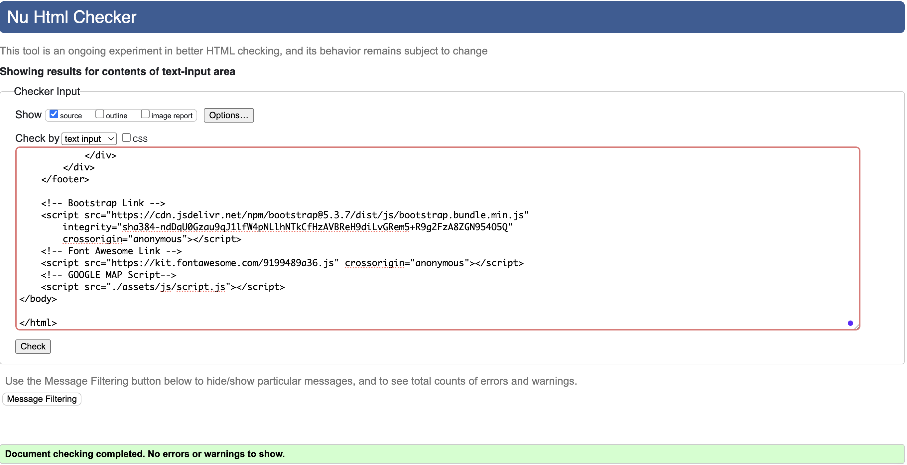
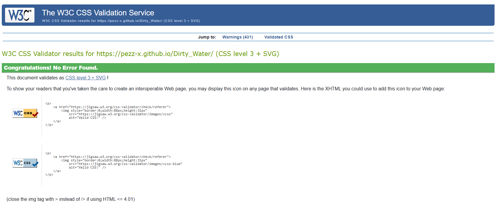
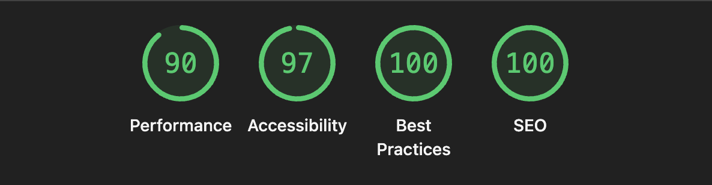

# Dirty_Water# Project Proposal: Sewage Discharge Awareness Website

## Project Overview

**Project Name:** *Dirty Water*

**Objective:** Build a public-facing website that empowers people to make informed decisions about when and where it’s safe to swim, surf, paddleboard, or walk near coastal or river water, based on near-time sewage discharge data.

---

---

## Target Audience

This site is for:

- Environmentally conscious individuals
- Families with children
- Surfers, swimmers, and dog walkers
- Outdoor enthusiasts
- Local community groups
- Anyone who wants to avoid unnecessary health risks from polluted water

---

## Idea

**Problem:**
Sewage is often discharged into rivers and the sea during storms or system overloads, but this information is often hard to understand, does not give advice or allows users to easily complain to local water companies.

**Solution:**
Create a simple, mobile-friendly website where users can check recent sewage discharge events at their local river or beach, learn about the risks, and take action if they wish.

---

##  Core Features

1. ** Interactive Map**
   A responsive map interface centered on Cornwall (for now) showing:
   - Sewage outflow points
   - Intuitive interface to show if discharge is happening, is not happening or offline

2. ** Sewage Discharge Points**
   Each point on the map includes:
   - Location name
   - Last known discharge event (with date/time)
   - Length of discharge (time)

3. ** Navigation Bar**
   Simple top navigation for:
   - Home / Map
   - About
   - FAQs
   - Contact

4. ** Hero Image**
   A powerful landing page image with a short mission statement and call-to-action button.

5. ** FAQs Page**
   - What is sewage discharge?
   - Is it legal?
   - What are the health risks?
   - Etc.

6. ** Take Action Section**
   - Links to local water authorities
   - Link to South West Water website

## __Detailed user stories with acceptance criteria__

Found in the project board here: [Project Board](https://github.com/users/Pezz-x/projects/4)

## __Future features of Dirty Water we decided were not for MVP__

   - use API for tide data (not possible for MVP as github pages not whitelisted)
    - show a yellow warning on the map for discharges made in the past 24 hours
   - display multiple tide locations and status in map
   - display tide tide and status closest to discharge point in map

---

## __Design Documentation__

### __Wireframes__
Wireframes were created to help visualise the user journey and final product. Both mobile and desktop wireframes were developed.

 ### __Colour Palette__

The colour palette was generated by uploading the hero-image into [Coolors](https://coolors.co/) and asking Coolors to extract fitting colours out of the image. The two dominant blue tones used throughout the website are taken from the image and were chosen to support the ocean theme. The other colours were selected for contrast, accessibility and aesthetic reasons.

### __Typography__
- Montserrat and Lexend font was used throughout for consistency. These fonts are considered professional and easily readable for users.

### __Image generation__
Hero image is a stock image taken from [Pexels](https://www.pexels.com/). Credit to [Berend de Kort](https://www.pexels.com/@berend/) for the image.

## Tech Stack

- **Frontend:** HTML, CSS, JavaScript
- **Mapping:** TBD (ArcGIS API with sewage discharge JSON)
- **Hosting:** GitHub Pages

## __Testing__

### __Code Validation__

All HTML and CSS code was validated using the W3C Markup Validation Service and W3C CSS Validation Service. The results are as follows:

__HTML Validation:__

- Initially when we ran the code through the HTML validator some warnings and errors were returned. There were warnings related to trailing slashes and some 'misuse of aria-label' warnings. There was one error related to a label's 'for' attribute not matching the corresponding input element's id.

- The trailing slashes were mostly in the header meta-content and were the result of AI code generation. These were removed. The 'misuse of aria-label' were related to the map key. These were not necessary as the key also contained text which stated what it was showing. The aria-label's were removed. Instead, an aria-label was added and a 'role' attribute to explain what the section as a whole was doing. 'Aria-hidden' was added to the visual key elements to ensure there was no confusion for screen-readers.

- The label and input element were amended so that they matched. The html validator showed no errors or warnings after these adjustments.

__CSS Validation:__

- No errors were found in the CSS code.

### __Lighthouse Testing__

- Lighthouse was used to test the performance and accessibility. The results are as follows:

- The original lighthouse report displayed some issues related to accessibility, best practices, SEO and particularly performance. To resolve the accessibility, best practices and SEO issues, a meta-description was added to the index.html page, accessibility-related attributes were reviewed, and some h5 elements were altered to h4 (to retain a sequentially-descending order of headers).

- The hero-image was having the largest negative impact on the performance of the site. We tried converting the image from jpg to webp format but this unexpectedly *increased* the file size. Instead, we cropped the size of the image using the inbuilt [Preview](https://support.apple.com/en-gb/guide/preview/welcome/mac) for Mac, then we compressed the image using an online image compressor tool: [Squoosh](https://squoosh.app/). This significantly improved performance.

- Lighthouse also suggested removing unused JavaScript and CSS. However, on closer inspection this was all being imported from libraries / frameworks (such as Bootstrap and Font Awesome) which we used in the webpage.

### __Deployment__

This project was deployed on GitHub. Below are the steps followed to deploy the website:
1. In the GitHub repository, navigate to the Settings tab.
2. Scroll down until GitHub Pages is found.
3. From the source section drop-down menu, select the main branch.
4. Once the main branch has been selected, hit the save button.
5. Finally, when the page is refreshed, a detailed ribbon display will indicate the successful deployment.

### Credits

- [Google Fonts](https://fonts.google.com/) for typography.
- [Coolors.co](https://coolors.co/) for palette selection.
- [Pexels](https://www.pexels.com/) for hero image.
- [Font Awesome](https://fontawesome.com/) for icons used within the website (e.g. social media links).
- [Microsoft Copilot](https://copilot.microsoft.com/) for image and text generation.
- [Bootstrap](https://getbootstrap.com/) for the CSS framework.
- [Am I Responsive](https://ui.dev/amiresponsive) for design example in this README.
- [Font Awesome](https://fontawesome.com/) for icons.

